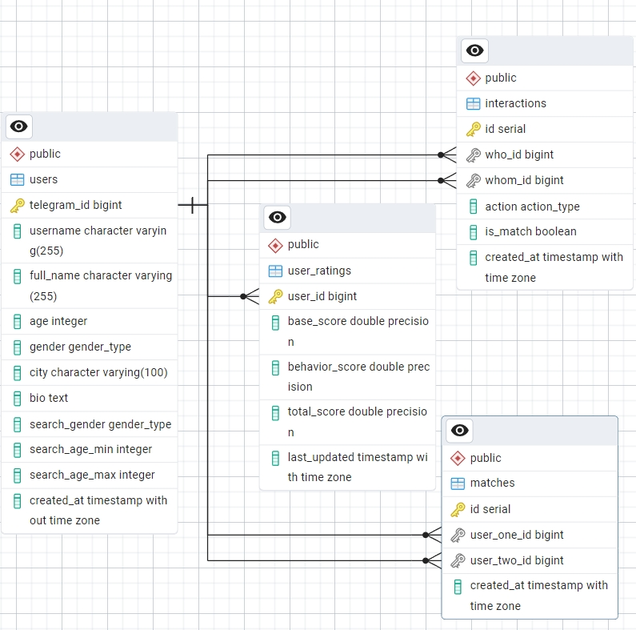
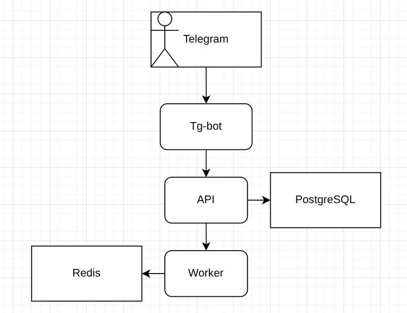

1. **Bot**:
    - *Стек*: aiogram
    - *Задача*: Принимает сообщения от юзера, рисует кнопки, отправляет картинки. Общается с API по HTTP
2. **API**:
    - *Стек*: FastAPI / SQLаlchemy
    - *Задачи*:
        1. Crud: Запись в таблицу users
        2. Логика свайпов: Запись в сущность interactions, проверка на мэтч и запись в сущность match
        3. Выдача анкет: Формирование ленты с учетом фильтров и исключением уже лайкнутых
3. **Worker**:
    - *Стек*: Celery
    - *Задачи*:
        1. Пересчитывает рейтинги раз в час. Следит за теми, кто ставит лайки и дизлайки, и обновляет статистику
        2. Кэш в Redis

# Диаграмма классов:

# Схема взаимодействия сервисов:
