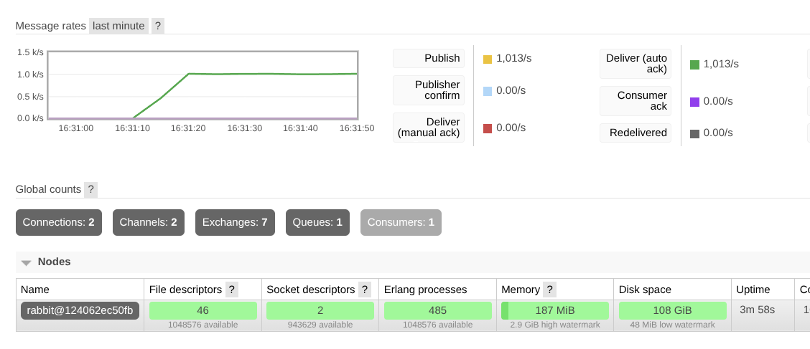
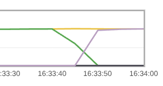

### Сравнивнение производительностей RabbitMQ и Redis

#### Введение
Для этой практики я подготовил базовую базу: написал на Go продюсера и консьюмера и по очереди прогонял через них разные типы нагрузки. Основная задача была просто понять, как на эти самые брокеры влияет размер сообщения и скорость их подачи. Тестировал вот такие размеры: 128 байт, 1 Кб и 10 Кб.

#### Результаты
Получилось не прям все идеально, но основная задача выполнена.

1. **Скорость отклика (Latency):**
   На легкой нагрузке Redis выдавал задержку меньше миллисекунды (около **0.4 мс**). В это же время у RabbitMQ задержка уже переваливала за **500 мс**. На это напрямую повлияло, то, что Redis работает в памяти.

2. **Пропускная способность:**
   Тестировались брокеры до 5000 сообщений в секунду. Ни один из них с этим не справился:
   * **Redis** уперся в потолок примерно на **2600 msg/sec**.
   * **RabbitMQ** - максимум около **1100–1200 msg/sec**.
   
   Еще при попытке дать 5000 msg/sec задержки у обоих брокеров увеличились до 3-4 секунд (P95). Это считается точка, где консьюмер перестает справляться и очередь не справляется с потоком.

3. **Размер сообщения:**
   Этот параметр повлиял на задержку, но не так сильно, как рост Rate. Получается количество сообщений в секунду явно важнее, чем объем данных в каждом из них.

#### Трудности и неполадки
В результатах есть один нюанс: в некоторых строчках количество полученных сообщений больше, чем отправленных. 
Это связано с тем, что после громадных тестов очереди не успевали полностью очиститься. Когда запускался следующий тест, консьюмер начинал дообрабатывать то, что осталось от предыдущего прогона. 
Исправить это можно просто очищая очереди принудительно перед каждым запуском.

#### Вывод

* **Redis** — это про скорость. Если нужно доставлять сообщения мгновенно и их очень много, это лучший вариант. Он начинает тормозить намного позже конкурента.
* **RabbitMQ** — заметно медленнее и тяжелее. У него есть другие достоинства, которые в этом задании вовсе не нужны.

---

## Табличка

| Брокер | Размер (B) | Цель (Rate) | Факт. пропускная способность (Throughput) | Сред. задержка (Avg Lat) | P95 задержка |
| :--- | :--- | :--- | :--- | :--- | :--- |
| **Redis** | 128 | 1000 | **761.83 msg/s** | **0.42 ms** | 0.58 ms |
| **Redis** | 128 | 5000 | 2607.19 msg/s | 238.75 ms | 3004.30 ms |
| **Redis** | 10240 | 5000 | 2310.42 msg/s | 901.48 ms | 3429.49 ms |
| **RabbitMQ** | 128 | 1000 | **763.77 msg/s** | **522.19 ms** | 970.37 ms |
| **RabbitMQ** | 128 | 5000 | 1115.34 msg/s | 1075.61 ms | 4310.24 ms |
| **RabbitMQ** | 10240 | 5000 | 1182.77 msg/s | 856.55 ms | 3689.99 ms |

## Скриншоты

После остановки получателя:

